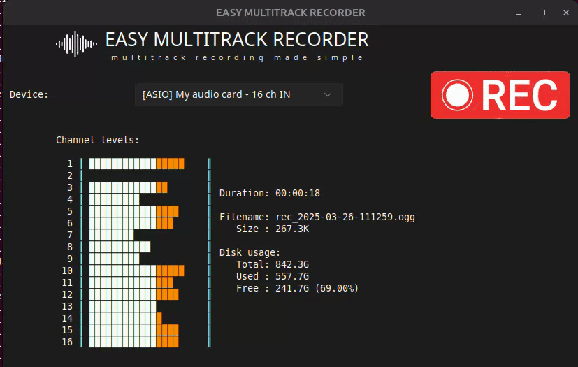

  

# what it is

If you want a simple no-fuss program to record your multi-track audio interface or mixer, this is the tool for you!

You can use it for example with the Behringer XR 18 or similar mixers, to record your live performances, etc. It supports ASIO, MME, etc on Linux , Windows, MacOS (untested)

It displays the levels of the various channels in realtime, to help you troubleshooting connection and/or gain issues.

In the information panel the used disk space as well as the remaining free one is shown.

## how many channels does it support?

As many as supported by the underlying PortAudio library, so basically unlimited :)

## maximum duration of the recorded file?

The maximum file duration should be limited only by the available disk space on your system..

In practice I have tested it up to 2 hours with 16 channels. 

# usage

1. install it (see below)
1. start the app
1. choose your device
1. click the big button REC
1. enjoy the recording:

  

When done, click the button again to stop. In the same folder where the app is located, an audio file will be created. It is a multichannel .ogg file.

# how to download / install 

Easy MultiTrack Recorder is distributed as a single file (easy no?).

Go the the Releases page https://github.com/luigi-bar/easy_multitrack_recorder/releases  
 and and download your needed version.

## Supported Operating Systems

| Operating System |Status| Supported Versions | Notes |
|---|---|---|---|
| Linux | |Ubuntu 20.04 or later (or compatible) |  |
| Windows | |Win10 or later |  |
|  | |Win7 or later | "legacy" build (not recommended) |
| macOS| | Any? |  Testing needed |

# For developers

Nice to see you here! - do you have a Mac maybe to help me in testing?

The app is written in python, and it is using:
- sounddevice to access all devices (including ASIO on Windows)
- soundfile to save on files
- tkinter for the ui
- sv-ttk for a nice ui style
- pyinstaller to pack it all in single executable

A note on Win7: since it is EOL, we are forced to use an old python version, old packages.. The build needs some hacks, and this is the reason for a dedicated GitHub action and a different release

## how to run from source

### linux

    python -m venv easy_mtr
    . easy_mtr/bin/activate
    python -m pip install -r requirements.txt

    cd src
    python easy_multitrack_recorder.py

### windows

    python -m venv easy_mtr
    audioenv\Scripts\activate
    python -m pip install -r requirements.txt

    cd src
    python easy_multitrack_recorder.py

### mac 

follow the same instructions as per Linux. If you get issues, please open a ticket

## how to build from source

first install (see above), then:

    cd src
    pyinstaller -F easy_multitrack_recorder.py --add-data "assets/*:assets" --icon "assets/icon.ico"

For additional info , check the source code of the repo github actions 
